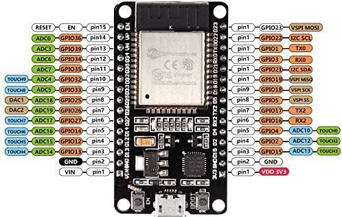
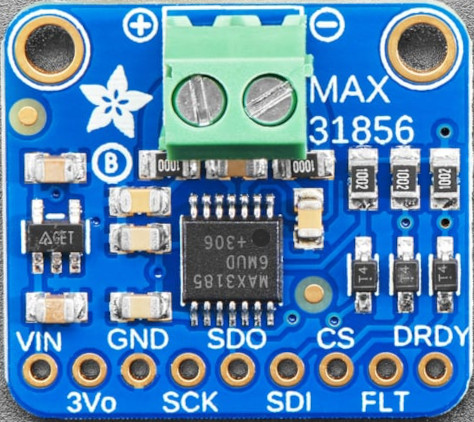
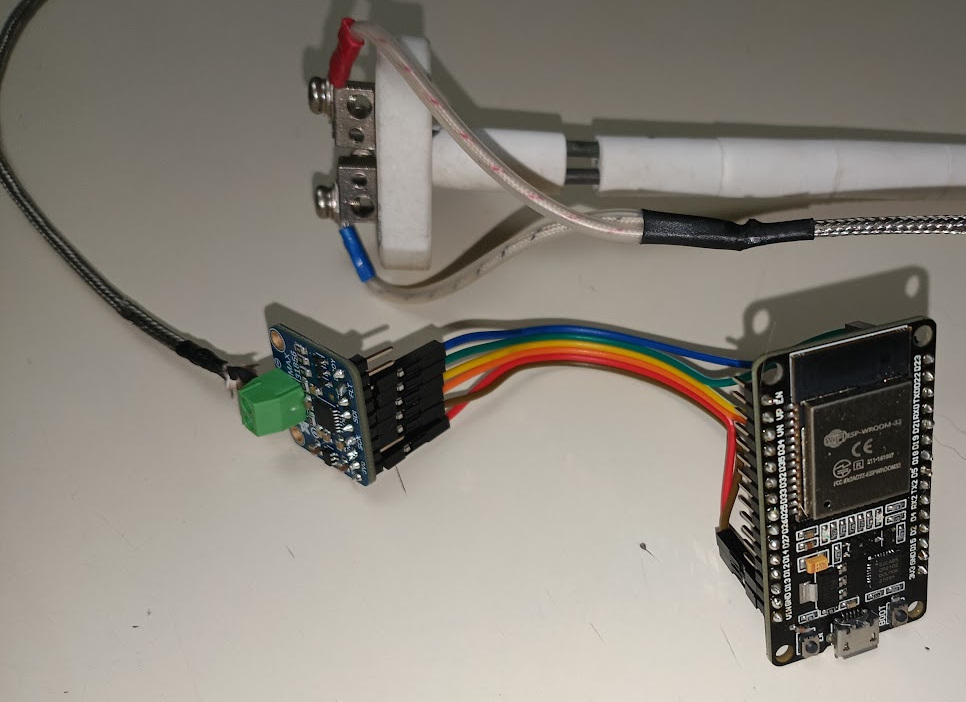
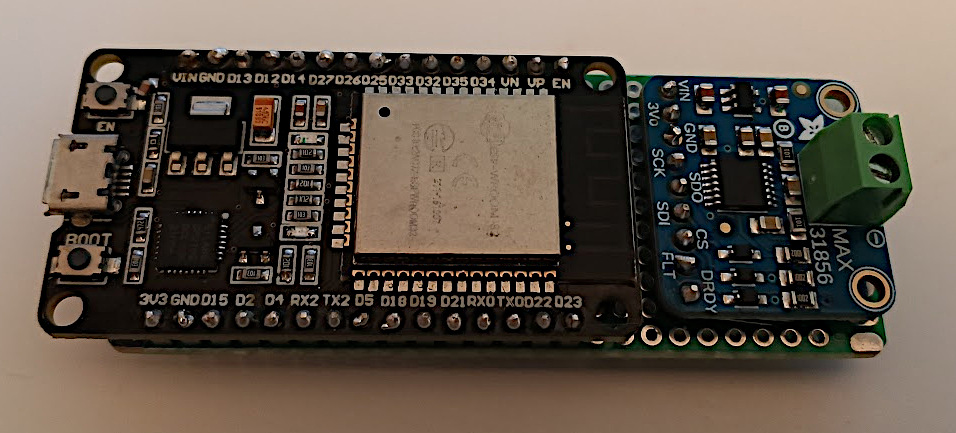
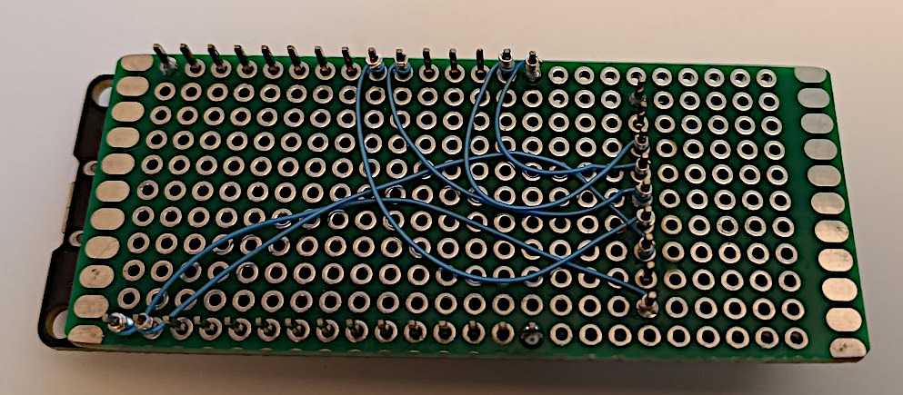
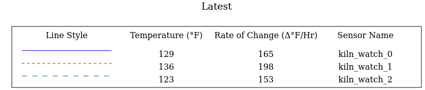
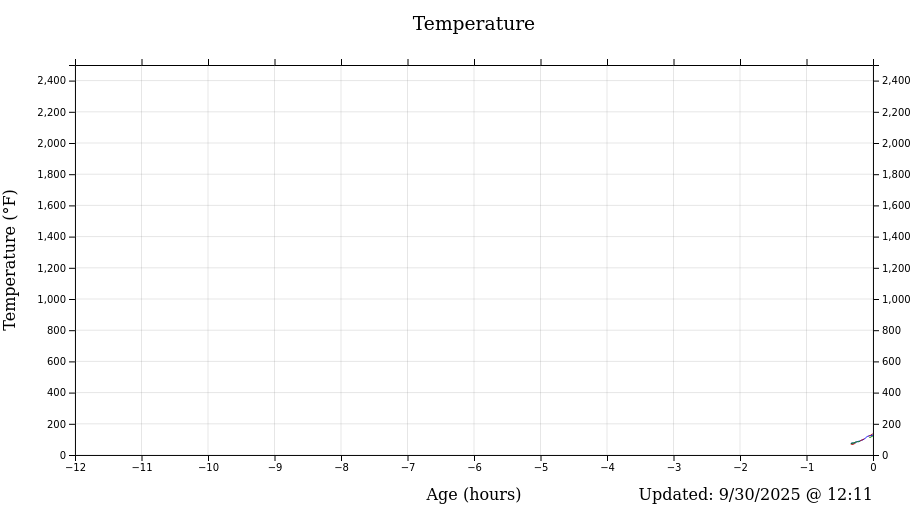
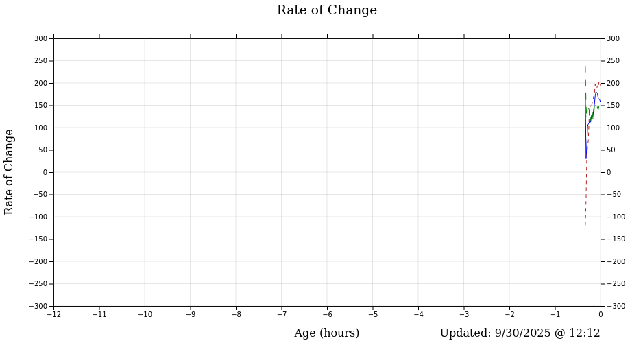

# kiln-watch

This project provides the means automate the monitoring of kiln temperatures using simple breakout boards connected to a type K thermocouple.

## Problem

Monitor a gas fired kiln at multiple kiln positions to better assess the progression of the firing process and manually adapt as required.  The kiln is located outdoors  making manual observation over long periods inconvenient.

## Goals

- Create a sensor at the kiln that is able to:
	- Connect to the local network using WiFi.
	- Capture the kiln temperature.
	- Broadcast the kiln temperature over the local network at regular intervals.
- Create a network service on the local network that is able to:
	- Capture the network broadcasts and decode the temperature readings of one or more sensors
	- Present the temperature readings to a user in graph form (Temperature / Time)
	- Present the ramp temperature ( Temperature change / Hour), update interval 15 min
	- Provide a web interface 

## Constraints

- The project members each have differing levels of skills, yet the solution must at lest be maintainable by the least capable team member.  As such, simplicity and re-use of existing capabilities are of utmost importance.
## Sensor

The sensor is be constructed as per the [ESPHome](https://esphome.io) instructions:

- [MAX31856 Thermocouple Temperature Sensor](https://esphome.io/components/sensor/max31856/)

Re-using ESPHome will allow the sensor to be tested first with ESPHome Assistant, before moving on to a custom service or integration with ESP Home Assistant.

### Bill of Materials

- 1 x [ESP32 ESP-32S WiFi Development Board](https://www.amazon.com/DORHEA-Development-Microcontroller-NodeMCU-32S-ESP-WROOM-32/dp/B086MJGFVV/)
- 1 x [Thermocouple Amplifier MAX31856](https://www.adafruit.com/product/3263)
- 1 x [Type K Thermocouple and wire](https://www.clay-king.com/product/geocorp-premium-8-type-k-thermocouple-with-block-and-wire/)
- 1 x [Jumper Wires](https://www.adafruit.com/product/1951)
- 1 x USB Power Bank

### ESP32 Pinout



### MAX31856 Pinout



### Wiring Instructions

|    ESP32 Pin    | Description                                | MAX31856 Pin |
| :-------------: | ------------------------------------------ | :----------: |
|       VIN       | Input voltage                              |     VIN      |
|       N/A       | Not used                                   |     3Vo      |
|       GND       | Ground                                     |     GND      |
| D18 (VPSI SCK)  | connects to the SPI **clk_pin**            |     SCK      |
| D19 (VSPI MISO) | connects to the SPI **miso_pin**           |     SDO      |
| D23 (VSPI MOSI) | connects to the SPI **mosi_pin**           |     SDI      |
|  D22 (GPIO22)   | connects to a free GPIO pin                |      CS      |
|       N/A       | Not Used                                   |     FLT      |
|       N/A       | Not Used                                   |     DRDY     |
|                 | connects to the thermocouple positive lead |     (+)      |
|                 | connects to the thermocouple negative lead |     (-)      |

### Wiring completed



For the final configuration the breakout boards were mounted on a piece of protoboard and wire wrapped.




### Install firmware

The firmware for the ESP32 device will be created using [ESPHome](https://esphome.io/) and flashed to the device over USB.  So, first install ESPHome as follows.

The instructions here are given for Ubuntu 22.04.5 LTS.

Install prerequisites:

```
% sudo apt update
% sudo apt install python3 python3-pip python3.10-venv
```

Ensure the user (john) is a member of the **dialout** group:

```
% id
uid=9000(john) gid=9000(john) groups=9000(john),20(dialout)
```

If the **dialout** group is not assigned to the user (john), added it:

```
% sudo usermod -a -G dialout john
% newgrp dialout
```

Install ESPHome:

```
% python3 -m venv vesphome
% source vesphome/bin/activate
% pip3 install esphome
```

Edit the configuration file, [kiln-watch.yaml](kiln-watch.yaml).

Specifically, edit the substitutions section:

```
substitutions:
  device_index: "0" # The device index, used to differentiate between devices
  device_name: "kiln_watch_${device_index}"
  ssid: "....."
  wifi_passwd: "....."
```

The most important substitutions are **ssid** and **wifi_password**. Set these as required to log onto your local WiFi.

Plug the ESP32 device into an available USB port and verify the device is created:

```
% ls -la /dev/ttyUSB*
```

Compile and flash the firmware to the ESP32 device:

```
% esphome upload kiln-watch.yaml
```

### Test the firmware installation

At this point the ESP32 should be broadcasting messages every 10 seconds onto the local network over WiFi.  We can check this using the [udp_listen.py](udp_listen.py) script.  However, first we must check the status of the firewall on the local system.

Determine if the firewall is enabled:

```
% sudo ufw status
```

If the firewall is **active**, we must create a rule to allow it to pass through UDP packets on port 23464.

```
% sudo ufw allow 23464/udp 
```

Now, run the [udp_listen.py](udp_listen.py) script and wait for updates about every 10 seconds:

```
% python3 udp_listen.py 
Listening for UDP broadcasts on port 23464...
KW,kiln_watch_0,0,24
KW,kiln_watch_0,0,24
KW,kiln_watch_0,0,24
```

The broadcast data is comma delimited with each position containing:

| Position | Description                                                                   |
| :------: | ----------------------------------------------------------------------------- |
|    0     | Always KW to identify the packet as a kiln-watch packet                       |
|    1     | The device_name as specified in the [kiln-watch.yaml](kiln-watch.yaml) file.  |
|    2     | The device_index as specified in the [kiln-watch.yaml](kiln-watch.yaml) file. |
|    3     | The measured temperature in Celcius.                                          |

## Service2

The Kiln Watch Services runs on another ESP32 board, listens for client broadcasts, then presents a web site that presents the status of all clients.

This service has the following software requirements:

- [MicroPython](https://micropython.org/)
- [esptool](https://docs.espressif.com/projects/esptool/en/latest/esp32/installation.html)
- [pyboard-rshell](https://github.com/dhylands/rshell)
- [Microdot](https://microdot.readthedocs.io/en/latest/)

Install esptool:

~~~bash
% pip install esptool
~~~

Install rshell:

~~~bash
% sudo apt install pyboard-rshell
~~~

Download  the [MicroPython firmware](https://micropython.org/download/ESP32_GENERIC/)

Install the firmware:

~~~bash
% esptool -p /dev/ttyUSB0 erase_flash
% esptool -b 115200 -p /dev/ttyUSB0 -c esp32 write-flash 0x1000 ESP32_GENERIC-20251209-v1.27.0.bin
~~~

## Service

The Kiln Watch Service is implemented as a web app that listens for sensor reports and web requests.  The service is implemented in python.

### Prerequisites

The Kiln Watch Service is built using [Python Poetry](https://python-poetry.org/). Please see the [docs](https://python-poetry.org/docs/) for the installation procedures.

### Run the Service

By default the service listens on port 4000.  If your firewall is up, add a rule to allow access to port 4000.

```bash
% sudo ufw allow 4000/tcp
```


```bash
% poetry run kwserv

 * Serving Flask app 'kiln_watch_service.Service'
 * Debug mode: off
INFO:WARNING: This is a development server. Do not use it in a production deployment. Use a production WSGI server instead.
 * Running on all addresses (0.0.0.0)
 * Running on http://127.0.0.1:4000
 * Running on http://192.168.1.194:4000
 * 
```

### View the application

When the service runs, it lists the URLs on which the application is available.   Open one of these URLs with a web browser to reveal the application.

```bash
% firefox http://192.168.1.194:4000
```

The application contains a single page with the following three sections:







All sections are updated every 60 seconds with the line graphs proceeding right to left.
